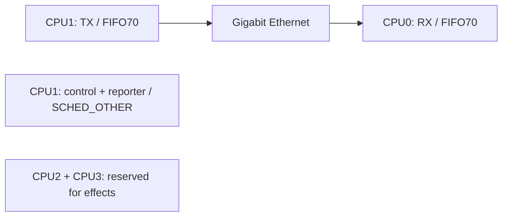

# Pi4-AoIP

**English** | [Русский](README.ru.md)

An AoIP platform library and service for **Raspberry Pi 4 Model B** running
**PREEMPT_RT**. It selects the wired interface, assigns network threads to
CPU cores and starts the shared runtime from AoIP-lib. Installation uses a
Debian `.deb` package.

**[Getting started](#quick-start)** · **[CPU allocation](#cpu-allocation)** · **[Documentation](#documentation)** · **[License](LICENSE)**

## Components

| Component | Purpose |
|---|---|
| `Pi4AoIP::platform` | Pi 4/RT checks, Ethernet IPv4 selection and thread affinity |
| `aoip_peer_rpi4` | Runs the shared synthetic PCM peer with the board's scheduling policy |
| `pi-aoip.service` | Dedicated user, RT limits, persistent state and automatic startup |
| `piaoip-configure` | Configures the interface and the computer's IPv4 address |

## CPU allocation



Networking uses **CPU0/CPU1** only. CPU2/CPU3 are reserved for effects.
The library does not reconfigure IRQs, Wi-Fi, Bluetooth, USB, GPIO or the CPU
frequency governor.

## Quick start

Requires a Pi 4, Debian 13 ARM64, an RT kernel already installed and wired
Gigabit Ethernet.

```sh
git clone --recurse-submodules https://github.com/danrey-bilo/Pi4-AoIP.git
cd Pi4-AoIP
sudo apt install build-essential cmake
taskset -c 0,1 cmake -S . -B build -DCMAKE_BUILD_TYPE=Release
taskset -c 0,1 cmake --build build --parallel 2
./build/bin/aoip_peer_rpi4 --check
```

This builds the platform library and service without development tools.
Installation and Ethernet configuration are covered in the
[installation guide (Russian)](docs/BUILD.md). The package does not install
an RT kernel or change the operating system's IP addresses.

## Repository layout

```text
include/aoip/rpi4.hpp   public platform API
src/rpi4.cpp           board model, RT, Ethernet and thread policy
apps/main.cpp          startup with the board's scheduling policy
external/AoIP-lib/     dependency pinned as a Git submodule
docs/                  API, installation and architecture
```

The supplied peer currently generates synthetic PCM and checks the return
stream. A physical ADC/DAC driver and effects processing are not implemented
in this project yet.

## Documentation

Detailed guides are currently available in Russian. Test reports link to the
private developer repository and require project access.

| Guide | Contents |
|---|---|
| [Build, installation and recovery](docs/BUILD.md) | Dependencies, DEB packages, configuration and updates |
| [Platform API](docs/API.md) | Integrating `Pi4AoIP::platform` into your application |
| [Architecture](docs/ARCHITECTURE.md) | Platform boundaries, service startup and thread placement |
| [Technical overview](docs/TECHNICAL.md) | Transport characteristics and operating limits |
| [Testing](https://github.com/danrey-bilo/AoIP-debug-tool/blob/main/docs/pi4/TESTING.md) | Test procedure and measurement scope |
| [Build validation](https://github.com/danrey-bilo/AoIP-debug-tool/blob/main/docs/pi4/INITIAL-BUILD-VALIDATION.md) | Checks performed on the separated repository |

## Development tooling

Tests, executable examples, diagnostics and installer build scripts are maintained
in the private [AoIP-debug-tool](https://github.com/danrey-bilo/AoIP-debug-tool) repository for authorized project developers.
They are not part of this library or its build requirements.

## Related projects

| Repository | Responsibility |
|---|---|
| [AoIP-lib](https://github.com/danrey-bilo/AoIP-lib) | Protocol, PCM, queues, timeline buffering and UDP peer |
| [Pi4-AoIP](https://github.com/danrey-bilo/Pi4-AoIP) | Raspberry Pi 4, PREEMPT_RT, Ethernet, CPU0/CPU1, systemd and DEB |
| [Win11-asio-AoIP](https://github.com/danrey-bilo/Win11-asio-AoIP) | ASIO DLL, Windows network threads, settings panel and MSI |

## License

Personal, noncommercial use is free. Commercial use requires a separate paid
written license from the copyright holder. See the [license terms](LICENSE)
or the [Russian explanation](docs/LICENSE-RU.md).
