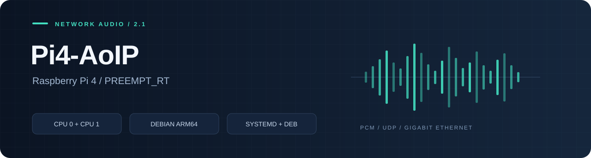
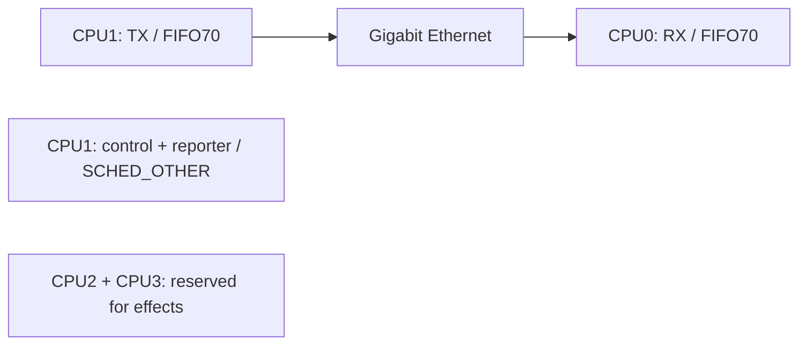

# Pi4-AoIP

[English](README.md) | **Русский**

Платформенная библиотека и служба AoIP для **Raspberry Pi 4 Model B** с
**PREEMPT_RT**. Выбирает проводной интерфейс, назначает CPU сетевым потокам
и запускает общий runtime из AoIP-lib. Устанавливается пакетом `.deb`.

**[Начало работы](docs/BUILD.md)** · **[Архитектура](docs/ARCHITECTURE.md)** · **[Техническое описание](docs/TECHNICAL.md)** · **[Проверки](docs/TESTING.md)** · **[Лицензия](docs/LICENSE-RU.md)**

## Назначение

| Компонент | Что делает |
|---|---|
| `Pi4AoIP::platform` | Проверка Pi 4/RT, Ethernet IPv4, привязка потоков |
| `aoip_peer_rpi4` | Запуск общего синтетического PCM peer с политикой платы |
| `pi-aoip.service` | Отдельный пользователь, лимиты RT, состояние и автозапуск |
| `piaoip-configure` | Настройка интерфейса и IPv4 компьютера |
| `piaoip-doctor` | Проверка окружения, состояния и фактических CPU affinity |

## Распределение CPU



Сеть использует только **CPU0/CPU1**. CPU2/CPU3 оставлены для эффектов.
Библиотека не перенастраивает IRQ, Wi-Fi, Bluetooth, USB, GPIO или governor.

## Быстрый старт

Нужны Pi 4, Debian 13 ARM64, уже установленное RT-ядро и проводной Gigabit Ethernet.

```sh
git clone --recurse-submodules https://github.com/danrey-bilo/Pi4-AoIP.git
cd Pi4-AoIP
sudo apt install build-essential cmake dpkg-dev
taskset -c 0,1 sh packaging/debian/build-deb.sh
sudo apt install ./dist/piaoip-rpi4_2.1.0-1_arm64.deb
sudo piaoip-configure --interface eth0 --peer 192.168.50.1 --restart
piaoip-doctor
```

В `--peer` укажите **Ethernet IPv4 своего Windows-ПК**; адрес выше — пример.
До первой настройки служба завершается с подсказкой. Пакет не устанавливает
RT-ядро и не меняет адреса ОС. [Полная инструкция](docs/BUILD.md).

## Структура

```text
include/aoip/rpi4.hpp   API платформы
src/rpi4.cpp           модель, RT, Ethernet и политика потоков
apps/main.cpp          запуск с политикой платы
external/AoIP-lib/     зависимость, закреплённая git submodule
packaging/debian/      systemd, конфигурация, DEB и lifecycle scripts
tools/                 измерение загрузки CPU
tests/                 установленный SDK и жизненный цикл пакета
docs/                  API, установка и архитектура
```

**[API платформы](docs/API.md)** · **[Установка и восстановление](docs/BUILD.md)**

Готовый peer пока генерирует синтетический PCM и проверяет обратный поток.
Драйвер физического ADC/DAC и обработка эффектов здесь ещё не реализованы.

## Компоненты проекта

| Репозиторий | Ответственность |
|---|---|
| [AoIP-lib](https://github.com/danrey-bilo/AoIP-lib) | Протокол, PCM, очереди, временной буфер, UDP peer |
| [Pi4-AoIP](https://github.com/danrey-bilo/Pi4-AoIP) | Raspberry Pi 4, PREEMPT_RT, Ethernet, CPU0/CPU1, systemd и DEB |
| [Win11-asio-AoIP](https://github.com/danrey-bilo/Win11-asio-AoIP) | ASIO DLL, сетевые потоки Windows, панель настройки и MSI |

Личное некоммерческое использование бесплатно. Для коммерческого использования
требуется отдельная платная лицензия. [Условия](LICENSE) · [Пояснение](docs/LICENSE-RU.md).
