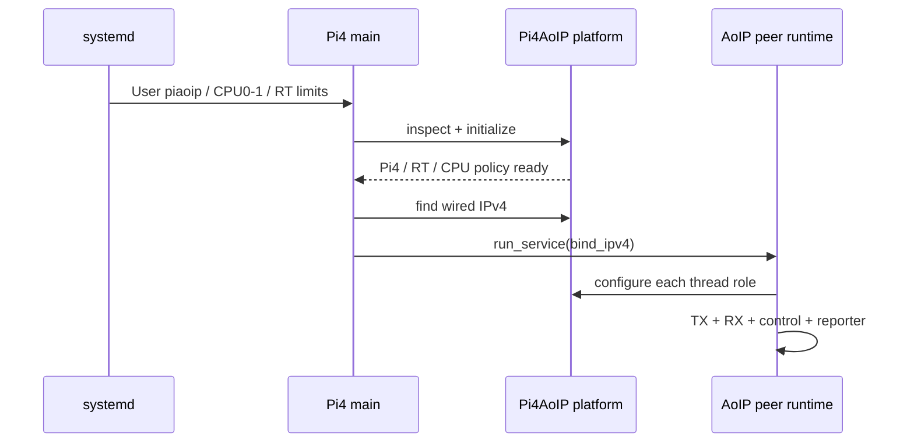

# Архитектура платформы Raspberry Pi 4

В `src/rpi4.cpp` нет собственной копии PCM, CRC, UDP control или TX-loop. Эти части
приходят из закреплённой AoIP-lib. `apps/main.cpp` проверяет окружение, ждёт Ethernet
и передаёт выбранный IPv4 общему сервису. Системная адресация не изменяется.

## CPU и права

`initialize()` ограничивает главный поток CPU0/CPU1 до создания остальных потоков.
RX закрепляется за CPU0/FIFO70, TX за CPU1/FIFO70, control/reporter за CPU1/SCHED_OTHER.
Systemd задаёт общую маску и разрешение RT. CPU2/CPU3 не используются даже при сбое
настройки: демон завершается при отказе применить thread policy.

IRQ остаются политикой ОС. Изоляция эффектов, RT-ядро, Ethernet full duplex и
достаточное охлаждение входят в подготовку системы, а не устанавливаются библиотекой.
На общей памяти/шине возможна конкуренция с эффектами даже при разных CPU.

## Жизненный цикл пакета

DEB содержит исполняемый файл, unit, conffile, средства настройки и документацию.
Пользователь piaoip владеет состоянием. Обновление не теряет настройки и не запускает
вручную остановленную службу. Удаление сохраняет состояние для восстановления.
SDK-пакет отдельный: для работы демона компилятор и заголовки не нужны.

## Расширение аудиобэкенда

Следующий уровень интеграции — ADC/DAC и обмен с эффектами через ограниченные очереди
с явным владением памятью, clock/drift control и xrun-диагностикой. Сейчас сервис
синтетический; этот репозиторий предоставляет платформенную основу, а не ALSA-драйвер.
